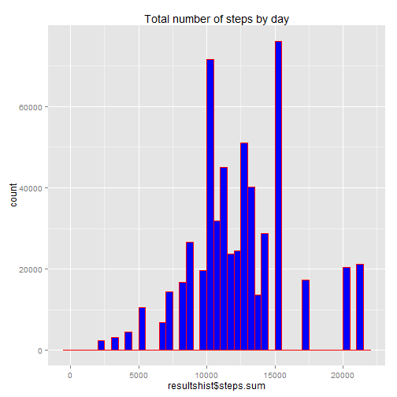
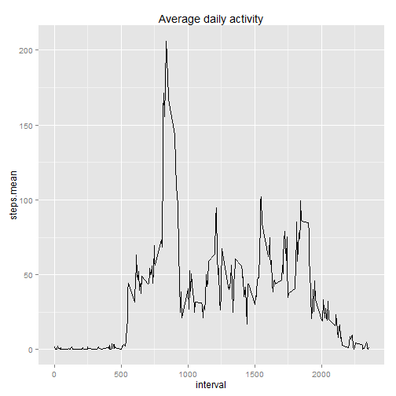
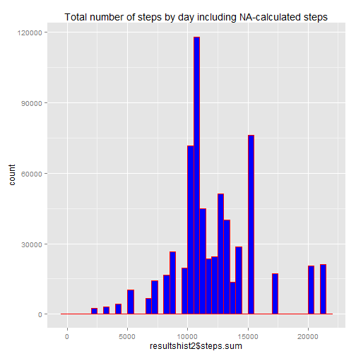
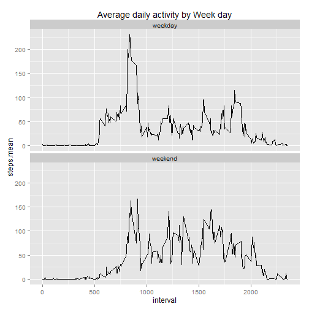

Reproducible Research - Peer Assessment 1
=========================================
Jorge Palma   
Calling the libraries used in the project 

```r
library(dplyr)
library(ggplot2) 
library(timeDate)
```
Read activity file. The activity file was already extracted and placed
in the working directory associated with the cloned repository.

```r
activity <- read.csv("activity.csv",sep = ",",header=TRUE)
```
Gooddata is a data frame with the observaions without the NAs. The date column is "Cast" to
date data type

```r
gooddata <- activity[complete.cases(activity$steps),]
gooddata$date <- as.Date(gooddata$date)
```
Report answers:

1.Calculate the total number of steps taken per day


Group by date to summarize the steps and calculate mean and median  

```r
resultshist <- gooddata %>% 
               group_by(date) %>% 
               summarize(steps.sum=sum(steps), 
               steps.mean=mean(steps),
               steps.median=median(steps))
```
2.Make a histogram of the total number of steps taken each day


```r
ggplot(data = resultshist, aes(x=resultshist$steps.sum)) +         
              geom_histogram(aes(weights=resultshist$steps.sum),
              colour = 'red',fill = "blue",binwidth = 500) +
              labs(title = "Total number of steps by day")
```

 

3.Calculate and report the mean and median of the total number of steps taken per day


```r
print(resultshist)
```

```
## Source: local data frame [53 x 4]
## 
##          date steps.sum steps.mean steps.median
## 1  2012-10-02       126  0.4375000            0
## 2  2012-10-03     11352 39.4166667            0
## 3  2012-10-04     12116 42.0694444            0
## 4  2012-10-05     13294 46.1597222            0
## 5  2012-10-06     15420 53.5416667            0
## 6  2012-10-07     11015 38.2465278            0
## 7  2012-10-09     12811 44.4826389            0
## 8  2012-10-10      9900 34.3750000            0
## 9  2012-10-11     10304 35.7777778            0
## 10 2012-10-12     17382 60.3541667            0
## 11 2012-10-13     12426 43.1458333            0
## 12 2012-10-14     15098 52.4236111            0
## 13 2012-10-15     10139 35.2048611            0
## 14 2012-10-16     15084 52.3750000            0
## 15 2012-10-17     13452 46.7083333            0
## 16 2012-10-18     10056 34.9166667            0
## 17 2012-10-19     11829 41.0729167            0
## 18 2012-10-20     10395 36.0937500            0
## 19 2012-10-21      8821 30.6284722            0
## 20 2012-10-22     13460 46.7361111            0
## 21 2012-10-23      8918 30.9652778            0
## 22 2012-10-24      8355 29.0104167            0
## 23 2012-10-25      2492  8.6527778            0
## 24 2012-10-26      6778 23.5347222            0
## 25 2012-10-27     10119 35.1354167            0
## 26 2012-10-28     11458 39.7847222            0
## 27 2012-10-29      5018 17.4236111            0
## 28 2012-10-30      9819 34.0937500            0
## 29 2012-10-31     15414 53.5208333            0
## 30 2012-11-02     10600 36.8055556            0
## 31 2012-11-03     10571 36.7048611            0
## 32 2012-11-05     10439 36.2465278            0
## 33 2012-11-06      8334 28.9375000            0
## 34 2012-11-07     12883 44.7326389            0
## 35 2012-11-08      3219 11.1770833            0
## 36 2012-11-11     12608 43.7777778            0
## 37 2012-11-12     10765 37.3784722            0
## 38 2012-11-13      7336 25.4722222            0
## 39 2012-11-15        41  0.1423611            0
## 40 2012-11-16      5441 18.8923611            0
## 41 2012-11-17     14339 49.7881944            0
## 42 2012-11-18     15110 52.4652778            0
## 43 2012-11-19      8841 30.6979167            0
## 44 2012-11-20      4472 15.5277778            0
## 45 2012-11-21     12787 44.3993056            0
## 46 2012-11-22     20427 70.9270833            0
## 47 2012-11-23     21194 73.5902778            0
## 48 2012-11-24     14478 50.2708333            0
## 49 2012-11-25     11834 41.0902778            0
## 50 2012-11-26     11162 38.7569444            0
## 51 2012-11-27     13646 47.3819444            0
## 52 2012-11-28     10183 35.3576389            0
## 53 2012-11-29      7047 24.4687500            0
```

What is the average daily activity pattern?


Grouping the data by interval and calculating the mean

```r
resultsts <- gooddata %>% 
             group_by(interval) %>% 
             summarize(steps.mean=mean(steps))
```

Plotting results and Reporting the 5 minutes interval with the highest value

```r
ggplot(resultsts, aes(x = interval, y = steps.mean)) +
       geom_line() +
       labs(title = "Average daily activity")
```

 

```r
print(resultsts[resultsts$steps.mean == max(resultsts$steps.mean),])
```

```
## Source: local data frame [1 x 2]
## 
##   interval steps.mean
## 1      835   206.1698
```

Imputing missing values


1.Calculate and report the total number of missing values in the dataset (i.e. the total number of rows with NAs)


```r
print(sum(is.na(activity$steps)))
```

```
## [1] 2304
```

2.Devise a strategy for filling in all of the missing values in the dataset. The strategy does not need to be sophisticated. For example, you could use the mean/median for that day, or the mean for that 5-minute interval, etc.

The strategy here is to use the mean calculated for the day of the week, if the value is available. Otherwise
the mean value from the interval is used. If neither of mean values exist the value 0.001 is assigned to the
missing step.

```r
newactivity <- activity

newactivity$date <- as.Date(newactivity$date)

for (i in 1:length(newactivity$date)){
  
  if(is.na(newactivity$step[i])) {
    
    if (length(resultshist[resultshist$date == newactivity$date[i],]$steps.mean) > 0) {
      
      newactivity$steps[i] <- resultshist[resultshist$date == newactivity$date[i],]$steps.mean
      
    } else if (length(resultsts[resultsts$interval == newactivity$interval[i],]$steps.mean) > 0) {
      
         newactivity$steps[i] <- resultsts[resultsts$interval == newactivity$interval[i],]$steps.mean
         
      } else {
        newactivity$steps[i] <- 0.001
      }    
  } 
  
}
```
3.Create a new dataset that is equal to the original dataset but with the missing data filled in.


The new data does not contain NAs

```r
summary(newactivity)
```

```
##      steps             date               interval     
##  Min.   :  0.00   Min.   :2012-10-01   Min.   :   0.0  
##  1st Qu.:  0.00   1st Qu.:2012-10-16   1st Qu.: 588.8  
##  Median :  0.00   Median :2012-10-31   Median :1177.5  
##  Mean   : 37.38   Mean   :2012-10-31   Mean   :1177.5  
##  3rd Qu.: 27.00   3rd Qu.:2012-11-15   3rd Qu.:1766.2  
##  Max.   :806.00   Max.   :2012-11-30   Max.   :2355.0
```
4.Make a histogram of the total number of steps taken each day and Calculate and report the mean and median total number of steps taken per day. Do these values differ from the estimates from the first part of the assignment? What is the impact of imputing missing data on the estimates of the total daily number of steps?


```r
resultshist2 <- newactivity %>% 
                group_by(date) %>% 
                summarize(steps.sum=sum(steps),steps.mean=mean(steps),steps.median=median(steps))

ggplot(data = resultshist2, aes(x=resultshist2$steps.sum)) +         
              geom_histogram(aes(weights=resultshist2$steps.sum),
              colour = 'red',fill = "blue",binwidth = 500) +
              labs(title = "Total number of steps by day including NA-calculated steps")
```

 

The histogram shows a new high value. 


```r
print(resultshist2)
```

```
## Source: local data frame [61 x 4]
## 
##          date steps.sum steps.mean steps.median
## 1  2012-10-01  10766.19 37.3825996     34.11321
## 2  2012-10-02    126.00  0.4375000      0.00000
## 3  2012-10-03  11352.00 39.4166667      0.00000
## 4  2012-10-04  12116.00 42.0694444      0.00000
## 5  2012-10-05  13294.00 46.1597222      0.00000
## 6  2012-10-06  15420.00 53.5416667      0.00000
## 7  2012-10-07  11015.00 38.2465278      0.00000
## 8  2012-10-08  10766.19 37.3825996     34.11321
## 9  2012-10-09  12811.00 44.4826389      0.00000
## 10 2012-10-10   9900.00 34.3750000      0.00000
## 11 2012-10-11  10304.00 35.7777778      0.00000
## 12 2012-10-12  17382.00 60.3541667      0.00000
## 13 2012-10-13  12426.00 43.1458333      0.00000
## 14 2012-10-14  15098.00 52.4236111      0.00000
## 15 2012-10-15  10139.00 35.2048611      0.00000
## 16 2012-10-16  15084.00 52.3750000      0.00000
## 17 2012-10-17  13452.00 46.7083333      0.00000
## 18 2012-10-18  10056.00 34.9166667      0.00000
## 19 2012-10-19  11829.00 41.0729167      0.00000
## 20 2012-10-20  10395.00 36.0937500      0.00000
## 21 2012-10-21   8821.00 30.6284722      0.00000
## 22 2012-10-22  13460.00 46.7361111      0.00000
## 23 2012-10-23   8918.00 30.9652778      0.00000
## 24 2012-10-24   8355.00 29.0104167      0.00000
## 25 2012-10-25   2492.00  8.6527778      0.00000
## 26 2012-10-26   6778.00 23.5347222      0.00000
## 27 2012-10-27  10119.00 35.1354167      0.00000
## 28 2012-10-28  11458.00 39.7847222      0.00000
## 29 2012-10-29   5018.00 17.4236111      0.00000
## 30 2012-10-30   9819.00 34.0937500      0.00000
## 31 2012-10-31  15414.00 53.5208333      0.00000
## 32 2012-11-01  10766.19 37.3825996     34.11321
## 33 2012-11-02  10600.00 36.8055556      0.00000
## 34 2012-11-03  10571.00 36.7048611      0.00000
## 35 2012-11-04  10766.19 37.3825996     34.11321
## 36 2012-11-05  10439.00 36.2465278      0.00000
## 37 2012-11-06   8334.00 28.9375000      0.00000
## 38 2012-11-07  12883.00 44.7326389      0.00000
## 39 2012-11-08   3219.00 11.1770833      0.00000
## 40 2012-11-09  10766.19 37.3825996     34.11321
## 41 2012-11-10  10766.19 37.3825996     34.11321
## 42 2012-11-11  12608.00 43.7777778      0.00000
## 43 2012-11-12  10765.00 37.3784722      0.00000
## 44 2012-11-13   7336.00 25.4722222      0.00000
## 45 2012-11-14  10766.19 37.3825996     34.11321
## 46 2012-11-15     41.00  0.1423611      0.00000
## 47 2012-11-16   5441.00 18.8923611      0.00000
## 48 2012-11-17  14339.00 49.7881944      0.00000
## 49 2012-11-18  15110.00 52.4652778      0.00000
## 50 2012-11-19   8841.00 30.6979167      0.00000
## 51 2012-11-20   4472.00 15.5277778      0.00000
## 52 2012-11-21  12787.00 44.3993056      0.00000
## 53 2012-11-22  20427.00 70.9270833      0.00000
## 54 2012-11-23  21194.00 73.5902778      0.00000
## 55 2012-11-24  14478.00 50.2708333      0.00000
## 56 2012-11-25  11834.00 41.0902778      0.00000
## 57 2012-11-26  11162.00 38.7569444      0.00000
## 58 2012-11-27  13646.00 47.3819444      0.00000
## 59 2012-11-28  10183.00 35.3576389      0.00000
## 60 2012-11-29   7047.00 24.4687500      0.00000
## 61 2012-11-30  10766.19 37.3825996     34.11321
```

Are there differences in activity patterns between weekdays and weekends?

1.Create a new factor variable in the dataset with two levels – “weekday” and “weekend” indicating whether a given date is a weekday or weekend day.


```r
newactivity$weekday <- factor(ifelse(isWeekday(newactivity$date),"weekday","weekend"),
                               level=c("weekday","weekend"))

resultswk <- newactivity %>% 
             group_by(weekday,interval) %>% 
             summarize(steps.mean=mean(steps))
```
2.Make a panel plot containing a time series plot (i.e. type = "l") of the 5-minute interval (x-axis) and the average number of steps taken, averaged across all weekday days or weekend days (y-axis). See the README file in the GitHub repository to see an example of what this plot should look like using simulated data.

```r
ggplot(resultswk, aes(x = interval, y = steps.mean)) +
       geom_line() +
       facet_grid(. ~ weekday) +
       facet_wrap( ~ weekday,nrow=2) +
       labs(title = "Average daily activity by Week day")
```

 
